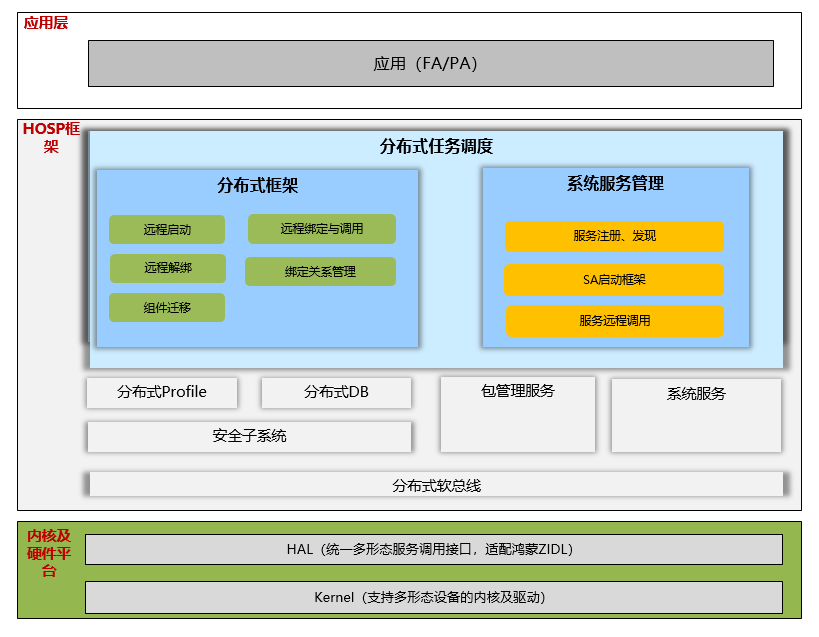

# 分布式调度组件<a name="ZH-CN_TOPIC_0000001162308327"></a>

-   [简介](#section11660541593)
-   [系统架构](#section13587185873516)
-   [目录](#section161941989596)
-   [约束](#section119744591305)
-   [使用](#section10729231131110)
-   [相关仓](#section1371113476307)

## 简介<a name="section11660541593"></a>

分布式任务调度模块负责跨设备组件管理，提供访问和控制远程组件的能力，支持分布式场景下的应用协同。主要功能如下：

-   远程启动FA：跨设备拉起远端设备上指定FA。
-   远程迁移FA：将FA跨设备迁移到远端。


## 系统架构<a name="section13587185873516"></a>



**图 1**  分布式调度组件架构图<a name="fig4460722185514"></a> 

## 目录<a name="section161941989596"></a>

分布式调度组件主要代码目录结构如下：

```
/foundation/distributedschedule/dmsfwk
├── interfaces                              # 接口代码
├── service                                 # 核心代码
|   ├── include
|   |   ├── caller_info.h                   # 调用方信息
|   |   ├── continuation_callback_death_recipient.h # 迁移回调死亡监听接口
|   |   ├── distributed_sched_ability_shell.h       # 迁移回调管理接口
|   |   ├── distributed_sched_continuation.h        # 迁移token管理接口
|   |   ├── distributed_sched_interface.h   # 对外接口
|   |   ├── distributed_sched_proxy.h       # 客户端接口
|   |   ├── distributed_sched_service.h     # 服务端接口
|   |   ├── distributed_sched_stub.h        # 服务端接口父类
|   |   ├── dtbschedmgr_log.h               # 日志模块
|   |   ├── parcel_helper.h                 # 分布式消息解析模块
|   |   ├── uri.h                           # uri接口头文件
|   ├── src
|   |   ├── continuation_callback_death_recipient.cpp # 迁移回调死亡监听实现
|   |   ├── distributed_sched_ability_shell.cpp       # 迁移回调管理实现
|   |   ├── distributed_sched_continuation.h          # 迁移token管理实现
|   |   ├── distributed_sched_proxy.cpp     # 客户端实现
|   |   ├── distributed_sched_service.cpp   # 服务端实现
|   |   ├── distributed_sched_stub.cpp      # 服务端父类实现
|   ├── BUILD.gn
├── sa_profile
├── utils
├── LICENSE
```

## 约束<a name="section119744591305"></a>

-   组网设备需在同一局域网中。
-   组网之前，需先完成设备绑定，绑定流程参见安全子系统中说明。

## 使用<a name="section10729231131110"></a>

-   **分布式任务调度模块编译**

分布式任务调度模块，其代码所在目录如下：

```
foundation/distributedschedule/dmsfwk
```


## 相关仓<a name="section1371113476307"></a>

分布式任务调度子系统

[distributedschedule\_dms\_fwk](https://https://gitee.com/openharmony/distributedschedule_dms_fwk)