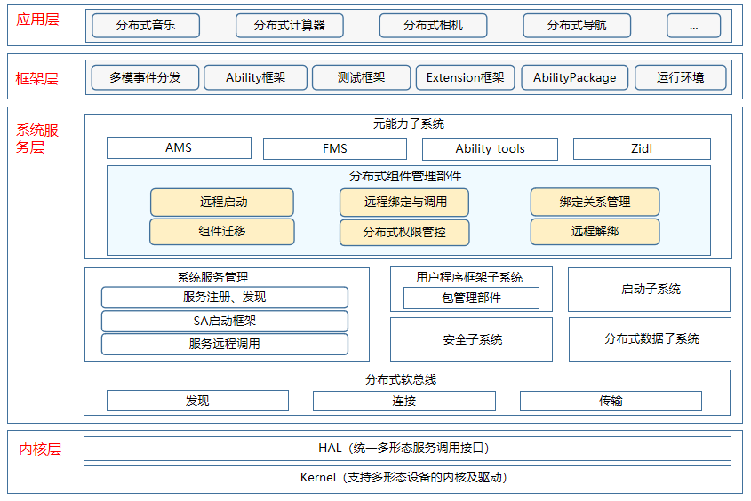

# 分布式组件管理部件<a name="ZH-CN_TOPIC_0000001115719369"></a>

-   [简介](#section11660541593)
-   [系统架构](#section13587185873516)
-   [目录](#section161941989596)
-   [相关仓](#section1371113476307)

## 简介<a name="section11660541593"></a>

分布式组件管理部件模块负责跨设备组件管理，提供访问和控制远程组件的能力，支持分布式场景下的应用协同。主要功能如下：

-   远程启动元能力：
    1. 跨设备拉起远端设备上的指定元能力。
    2. 跨设备拉起远端设备上的指定元能力，并支持含界面元能力结束时回传数据。
-   远程迁移元能力：将元能力跨设备迁移到远端设备。
-   远程绑定元能力：跨设备绑定远端设备上的指定元能力。
-   远程Call调用：获取远端指定通用组件的Caller通信接口，进行跨设备调用指定通用组件。

## 分布式组件管理部件架构<a name="section13587185873516"></a>

**图 1**  分布式组件管理部件架构图<a name="fig4460722185514"></a>




## 目录<a name="section161941989596"></a>

```
/foundation/ability
├── dmsfwk                      # 分布式组件管理部件模块
├── dms_fwk_lite                # 轻量分布式组件管理部件模块
```

## 相关仓<a name="section1371113476307"></a>

**分布式组件管理部件**

ability\_dms\_fwk

ability\_dms\_fwk\_lite